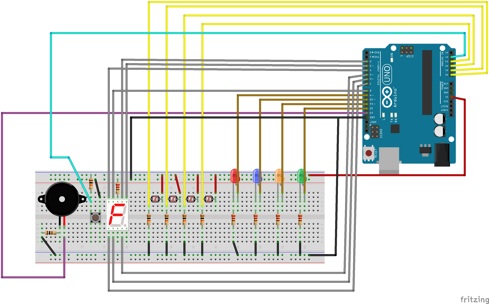
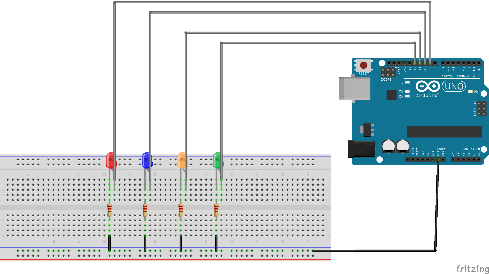
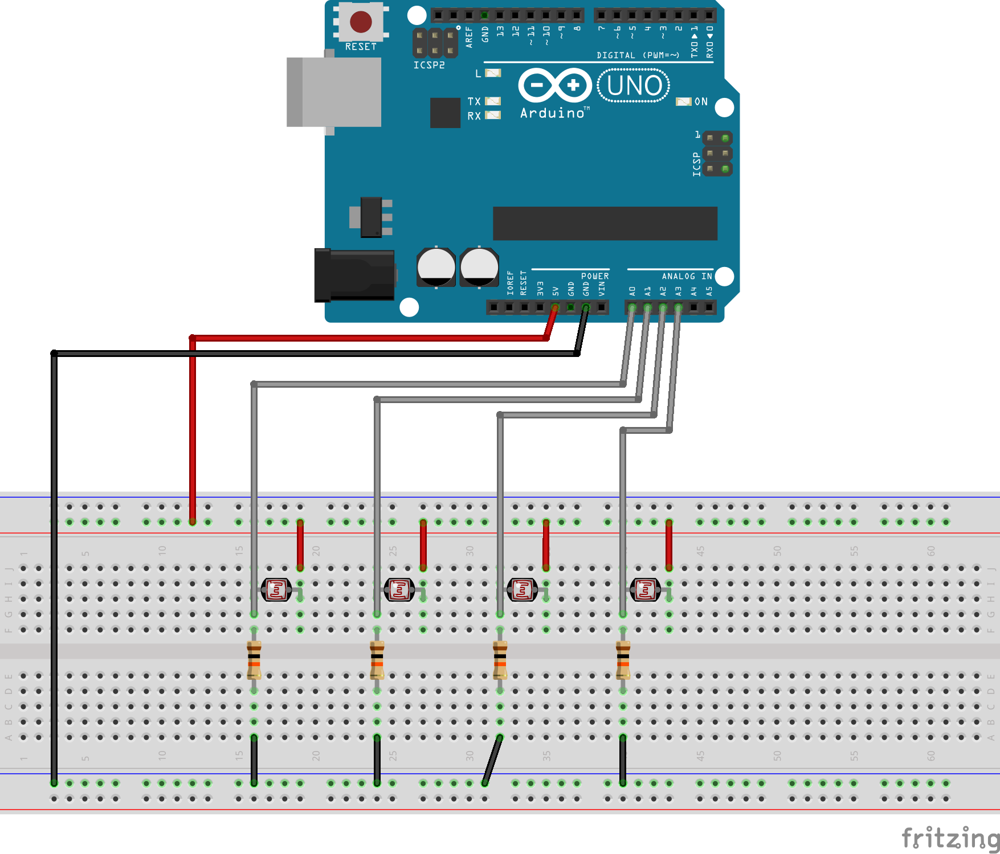
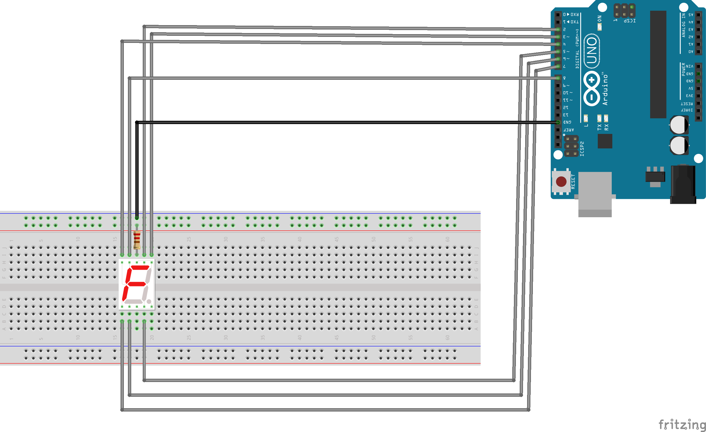
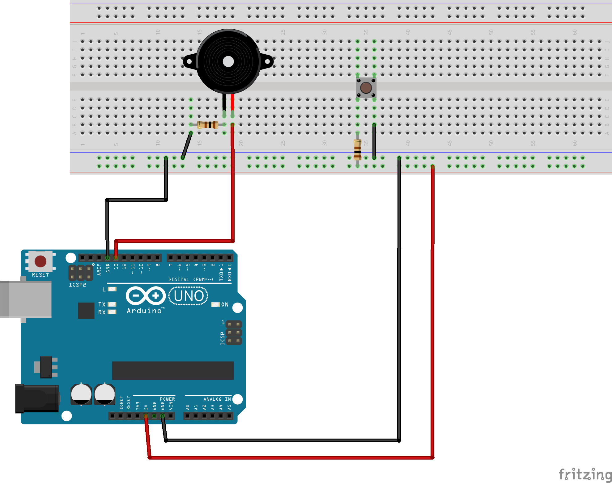

# Memory Game with Arduino Uno

## Introduction To Project

- The project is to build a simple Memory Game with Arduino Uno microcontroller board and appropriate interfacing hardware.

## Main Hardware Components

- Arduino Uno microcontroller board
- 4 LEDs with different colors
- 4 LDRs
- 2 Seven Segment Displays
- 1 Piezo Buzzer
- 2 Push Buttons

## How Game Works

1. Within the display time, LEDs light up in a random sequence and the player has to memorize this sequence.
2. In the recall time, the player has to repeat the same sequence on the LDR touch-buttons.
3. If the player enters a wrong sequence, or was not able to enter the sequence within the recall time, the game ends.
4. Otherwise, the player gets 1 point and the game moves on to the next round (another random sequence of same length is displayed and recalled).
5. If the player successfully completes 3 rounds with the same sequence length (same level), the game advances to the next level where sequences are of a higher length.

## Special Features

- At level 1, player is given a shorter sequence length and the sequence length increases at every level. Display time and recall time differ as appropriate for each level.
- The score is displayed using a seven-segment display throughout the game.
- At the very beginning (before level 1 starts), the player can select the difficulty setting using two push buttons and the seven-segment display.
- The speed at which the sequence is displayed, changes with difficulty setting.
- Pressing both push buttons at the same time will fix the selected difficulty setting and start level 1 of the game.
- The piezo buzzer should be used to provide sound effects for various events (level start. level end, correct sequence, wrong sequence).

## Complete Circuit Design

<figure>
    
    <figcaption align = "center"><b>Fig.5 - Complete Circuit</b></figcaption>
</figure>

## Separate Circuit Designs

<figure>
    
    <figcaption align = "center"><b>Fig.1 - LED Display Circuit</b></figcaption>
</figure>
<figure>
    
    <figcaption align = "center"><b>Fig.2 - LDR Circuit</b></figcaption>
</figure>
<figure>
    
    <figcaption align = "center"><b>Fig.3 - SSD Circuit</b></figcaption>
</figure>
<figure>
    
    <figcaption align = "center"><b>Fig.4 - Bazzer and PushButton Circuit</b></figcaption>
</figure>
